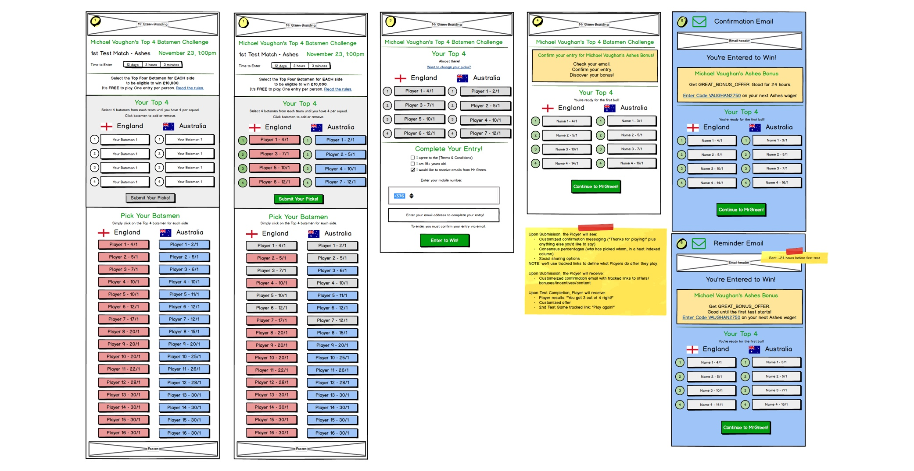
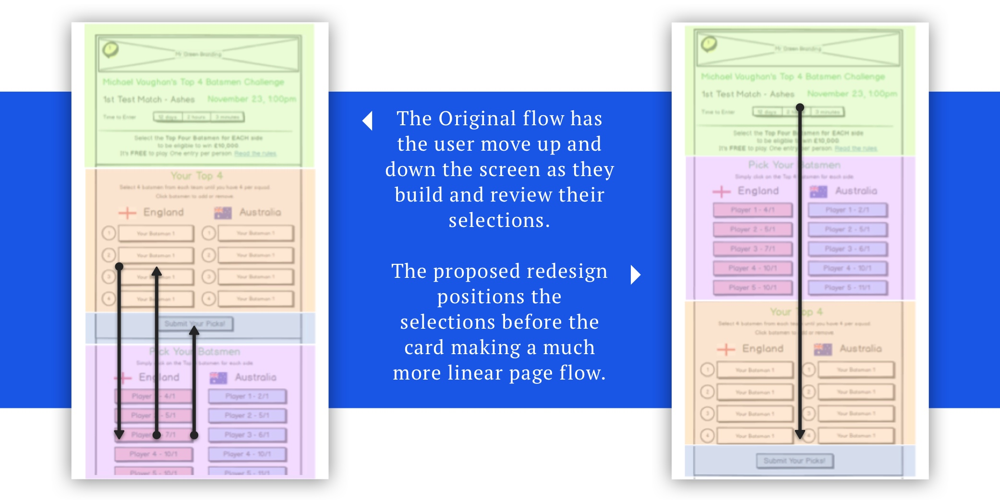

## Overview

[Chalkline Sports](http://chalklinesports.com/ "Chalkline Sports") were looking for an UX audit of a concept they had inflight with their dev team. The mobile website was in production for a few of their clients, allowing them to engage with new users interested in the 2017 Ashes Cricket Tournament and capture high-quality validated email addresses to support future marketing opportunities.

Aimed at the novice sports customers who are cricket enthusiasts, the game asks the user to pick their four top batsmen from each nation, the winner is then in with a chance to win a cash price.

The value proposition for operators working with Chalkline is to use this "Free to Play" engagement tool to:

- Associate their brand with a high profile tournament.
- Generate interactive content easily distributed on social media.
- Allow for multiple email touchpoints to upsell to real money products.
- Gather high-quality contact and sport affinity data for future marketing opportunities.

## The Starting Point

Most projects kick off with a verbal brief, however, I was fortunate this time, to get the rough mock-ups the development teams were working with as their guideline.

Starting with this as a base, and the purpose of the app as my KPI, I focused on the flow of information. The original first screen had too much information, particularly text before a user got into the game interaction.

Aside from this visual issue, my core change was to reorder the content so that the instructions and selections were presented initially and the summary selections and confirmation button moved further in the process; this is illustrated in the diagram below. You will see from the changes in the layout that the content is now in a more logical order, with the selection "cart" area now taken out of the flow, making it more globally accessible.

## Data Helpers

Data and statistics is another key product, vertical in the Chalkline suite and, I was keen to integrate this into this application. Whether aimed at the novice or experienced customer it is hard to remember key stats for each player, even the most dedicated fan would struggle.

Therefore to keep the user within the game and help them make selections even faster, I suggested adding the average number of runs next to each selection. This gives the user a quick supporting reference point in making their selections.

<YouTube youTubeId="pD6rCaDy64A" />

## Selection Cart

One of the biggest suggestions on my redesign was to move the cart area of the user's selections pinned to the bottom of the screen. As the user scrolled the intro text and long list of players they would always have access to the number of selections.

To help educate the user on this cart, I added a visual cue and I put forward the suggestion to have the selections drop into the cart area; - indicating where users could view more details.

Finally to make the process more automated for the user, especially when the user had made four selections per team the cart was exposed, nudging them onto the next step of the process. You will see from the prototype demo, the user can also view the summary of their selections at any time.

<a
  href="https://cyglap.axshare.com/home.html"
  target="_blank"
  className="btn btn-primary"
  rel="nofollow noopener noreferrer"
  title="View the Axure Protoype"
>
  View Axure Protoype
</a>

## Outcomes

As the first audit for a client, this was an interesting process to take a design and rework it with key improvements.

The UX improvements; the reflow of data and selection card area, were included in the final app design. With the other suggestions on the backlog to be added in future releases.

[Download Chalkline Sports Audit (1.7 Mb)](../../chalksport-ashes-audit.pptx "Download the Chalkline Sports Audit")
