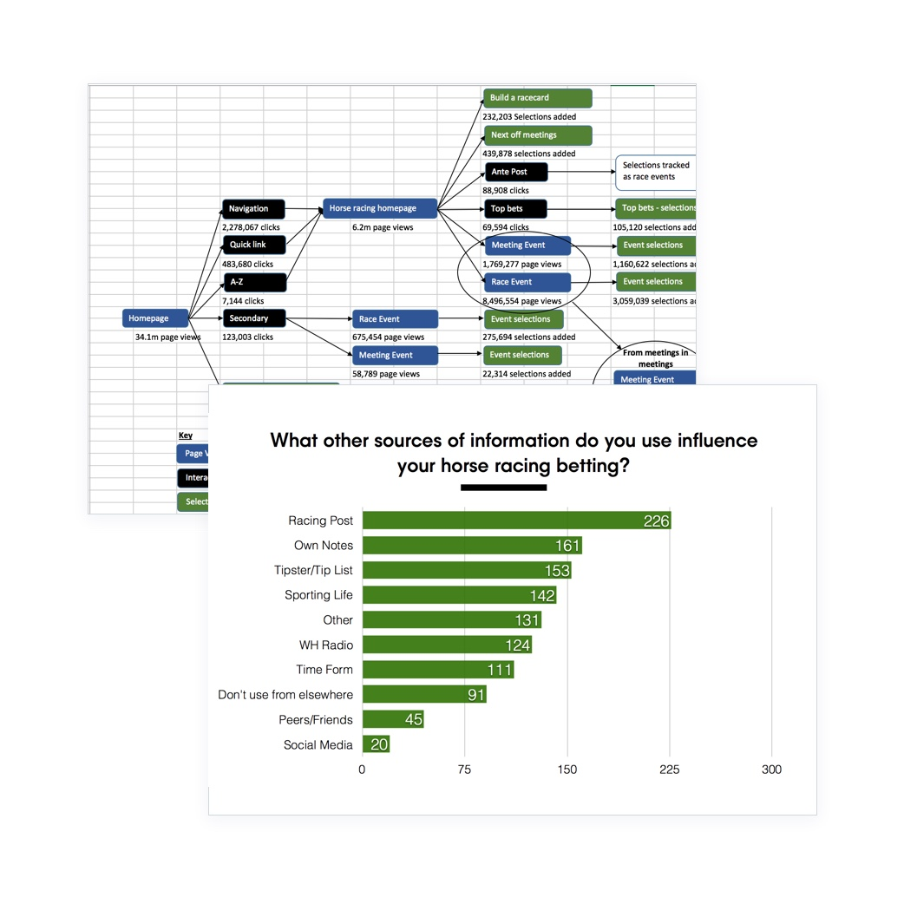

## In A Nutshell

William Hill is a household name - not just in the UK, but across the betting world. They've transitioned to the world of online gambling very successfully, with horse-racing accounting for **around £1.4billion of turnover in 2017 alone** (and it's very much part of their history).

But in today's highly competitive - and lucrative - world of online betting, William Hill can take for nothing for granted. So when their then Director of Sportsbook (i.e. Head of Betting) challenged the online product team to deliver the 'best horse racing experience on the market', he meant it.

It called for smart user-centred design. It called for a presence to combat the promiscuity of punters with an average of two or three accounts across different bookmakers.

And it called for a willingness to knuckle down to get the job and that's what I did…

### Gather Insights

The first stage of the process was to gather customer and business insights.

Customer Insights were gathered through reviewing comments left in our customer feedback tool, conducting a members survey and looking at the feedback that our support team received.

For business insights, we asked our racing trading team to send us their frustrations.

## The Outcome

This project is still in development and due to be released this year so unfortunately there is no big numbers to post yet but watch this space
