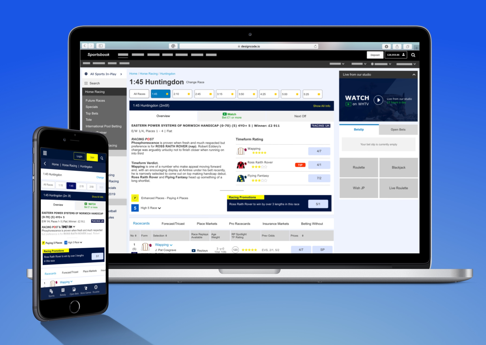

## In A Nutshell

[William Hill](https://www.williamhill.com "William Hill website") is a household name - not just in the UK, but across the betting world. They've transitioned to the world of online gambling very successfully, with horse-racing accounting for **around £1.4billion of turnover in 2017 alone** (and it's very much part of their history).

But in today's highly competitive - and lucrative - world of online betting, William Hill can take for nothing for granted. So when their then Director of Sportsbook (i.e. Head of Betting) challenged the online product team to deliver the **'best horse racing experience on the market'**, he meant it.

It called for smart user-centred design. It called for a presence to combat the promiscuity of punters with an average of two or three accounts across different bookmakers.

And it called for a willingness to knuckle down to get the job and that's what I did…

<ImageText image="hr1-gather-insights" altText="Gather Insights image">
  <h2>Gather Insights</h2>
  

    The first stage of the process was to gather customer and business insights.
  

  

    <b>Customer Insights</b> were gathered through reviewing comments left in
    our customer feedback tool, conducting a members survey and looking at the
    feedback that our support team received.
  

  

    For <b>business insights</b>, we asked our racing trading team to send us
    their frustrations.
  

</ImageText>

## Stakeholder Workshop

Getting stakeholders and Hippo's in a room for a few hours is not an easy task. For this project, we gathered stakeholders into a session.

Using techniques from Pete and I's [Lumina Institue](https://www.luma-institute.com/ "Lumina Institute Courses") training we conducted the workshop in a few hours.

<ImageText image="hr1-matrix" altText="Photos of workshop group">
  <h2>Workshop techniques</h2>

  

    <b>Whats on Your Radar</b> - We blocked out the key business goals for this
    project.
  

  

    <b>Affinity Clustering</b> - Using the gathered insights above we broke the
    group into teams and asked them to group the insights into clusters, and put
    these clusters in importance of primary, secondary and tertiary importance.
  

  

    <b>Buy A Feature</b> -&nbsp; We asked the two{" "}
    <a
      rel="noopener noreferrer nofollow"
      href="https://www.acronymfinder.com/Highest-Paid-Person%27s-Opinion-(HiPPO).html"
      target="_blank"
    >
      HIPPO's
    </a>
    in the workshop to use gold and silver stickers to call out what their
    priorities were.
  

  

    <b>Complexity Matrix </b>- Finally we took the output of the above steps and
    created a matrix that set out the product owners roadmap of work for the
    project.
  

</ImageText>

<ImageText image="hr1-personas" altText="Personas Text">
  <h2>Research and Personas</h2>
  

    The first page that we had to tackle was the meetings page. We set out to
    improve two KPI's:
  

  <ul>
    <li>NPS through improved nav</li>
    <li>increase in T/O via regions outside UK and USA</li>
  </ul>
</ImageText>

Starting with web analytics we identified the top user goals of the page and
again gathered insights into gaps in the page functionality.

The product team wanted to make sure the new page could support the ability to
continually provide the appropriate racing over the 23 hour period in a number
of countries. This led us to consider a rolling electronic program guide (EPG)
of data.

We worked with our intelligence team to identify the personas of our users and
it was clear that our older customers should be the focus of our work, being
worth 4 times as much as the younger profile.

## The Outcome

This project was in development when I left the company and no longer have access
to the statistics. However, it has made it to market and the company continues to
lead in this space.
