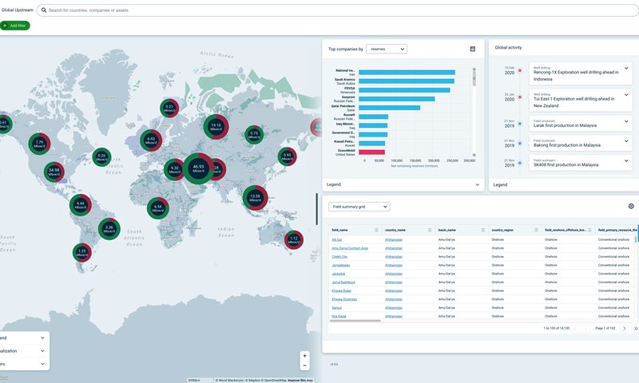
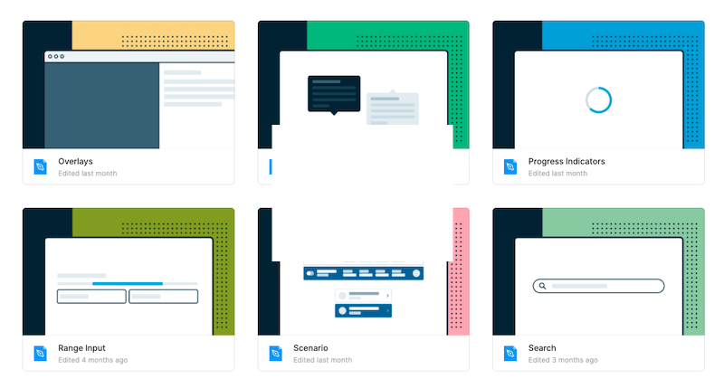
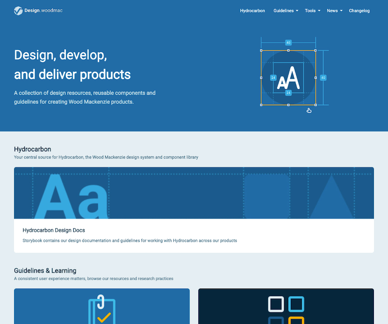

## Fast and Consistent

Design systems are more than just UI components that build interfaces, they are a centralised approach to creating user experiences.

Working on [Wood Mackenzie's](https://www.woodmac.com "Wood Mackenzie Website") in-house design system, Hydrocarbon, has taught me it takes a number of factors and disciplines to deliver a comprehensive system. The design system is central to the build of their cutting-edge [Lens product](https://www.woodmac.com/lens/ "Wood Mackenzie Lens Product")

Our goal is to allow teams to iterate and build their projects fast and consistently. To achieve this, a solid set of UI components also require centralised documentation, adoption by the production team and the creation of a design language.

<figcaption>Screenshot of Wood Mac's Lens product</figcaption>

## Our Design System

Design systems can vary in scale and depth and Hydrocarbon has aimed to be comprehensive yet lean. We provide teams with:

- React component library
- Figma component library
- A central documentation site that covers approach, governance, design language and patterns
- Monthly showcase and Q & A sessions
- Dedicated support and discussion channel

Our feature teams, and the team members, are distributed across many time zones. Our timing was impeccable as we released the majority of our systems as the working from home orders were set out across the globe.

By having the items outlined below teams were able to deliver continuously, and in some cases more efficiently than before.

## My Role

Hydrocarbon is both the name of our framework and an agile team dedicated to the design and development of the library.

Within the team, as the sole designer, my role was to act as a bridge between design and development. My role extended to advocation, documentation and building and curating our Figma component library.

I had a solid starting point from the existing Sketch based component library created by the team of talented designers at Wood Mackenzie. Our component process facilitates the designers in the team to contribute updates and new items in a structured process.

## Figma Pattern Library

Our [Figma](https://figma.com "Figma Website") library has been critical to enabling our design team to work with their product teams in a more harmonious way.

We opted to build out our Figma components to use a naming convention and structure as close to the React components as possible. This enabled a design language for designers and developers to converse using the same terminology. This simple issue had put up huge barriers in our previous Sketch-based system.

Aside from building the library a part of my duties are to educate and give the use of our Figma library. I have enabled the design team to work faster through:

- 1-1 sessions
- Regular Figma clinics tackling and demoing problems from the team
- Supporting documentation on our internal website

<figcaption>Snapshot of our Figma library</figcaption>

## Storybook

As an experienced designer, you would think the majority of time was in design tools, like Figma. However, equally as much time has been spent in text editors and [Storybook](https://storybook.js.org "Storybook Webiste") documenting our components and processes.

**"Less is more"** has been the objective and we continually refine our documentation to provide teams with the right amount of information in an accessible way.

## Component Flow Process

With components, Figma libraries and documentation in place the missing part was collaboration. Design systems exist to enable teams to do what they need to.

I took a step back from our current process and looked at where we had problems and bottlenecks. We refined this down to a leaner approach that we published on our docs.

This allowed anyone within a product team to contribute a proposal to the system.

Our process is centralised on discussing and stress-testing proposals before we move forward to development. By loading the discussions earlier we were able to reduce the need for fixes and updates at release.

We then move each component addition or update through three stages:

1. Specification
2. Build & Review
3. Document and Release

## Building .Design

As stated above design systems are more than just components. I build a [Gatsby](https://www.gatsbyjs.com "Gatsby Website") site under the domain _design.woodmac.com_ as a central location to contain everything related to our system.

This serves as a one-stop-shop for team members to find access points to the library, design patterns, research approaches our Figma guidelines and much more.

<figcaption>Screenshot of our static design hub</figcaption>

## Advocation

By enabling product teams to work faster and autonomously we won them over to a system-based approach. It made it easier to advocate for using a system and we have never received complaints from product teams that the system is restrictive.

In fact, our system is so well used that we demonstrated our approach through presentations to other teams within our parent company, and a few externals too.

These presentations were a great point to lift our head up from the work and see how far we have come in only two years.

## Future Steps

The scope of work and learning has been too much to encapsulate in this case study. What is for certain is that I have found my niche working in design systems.

Flipping between design, development and product work every day keeps my working day and future career path on its toes. I look forward to seeing where I can grow the system and my skills in the future.
