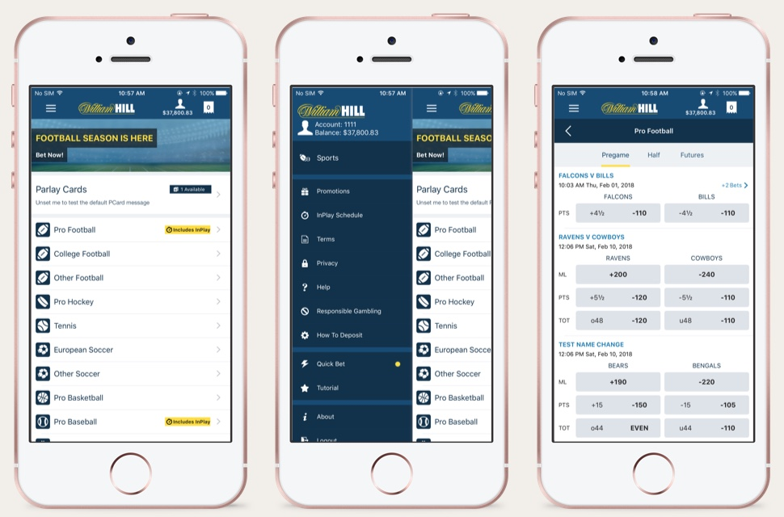
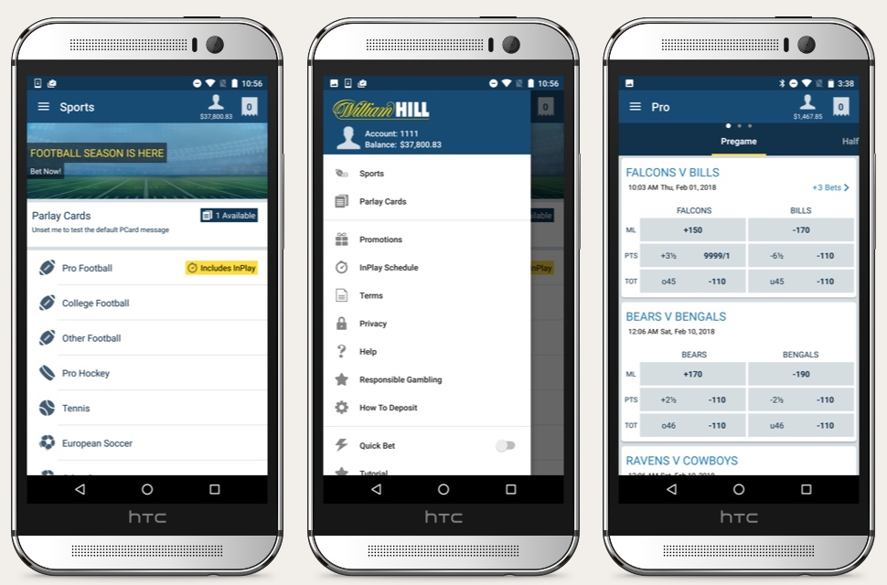

## Overview

After years of designing and building front-ends for the web, this was my first encounter with native apps.

Aside from popping my native design cherry, this project had the additional challenges of different time zones and betting terminology.

The task was to support the small product design team, in Nevada to build the iOS and Android Sportsbook apps. As Las Vegas is the only US state to allow legal gambling, the William Hill operation is more like a start-up. This was a great opportunity to work with a small, focused team on a new product. The team consisted of myself for UX and UI, one native developer, a systems architect, a business analyst and the product owner.

Aside from my design background, I was able to bring my experience from the European Sportsbooks to the table. And thanks to my Dad's love of the [New England Patriots](https://www.patriots.com/ "New England Patriots Website") I also had the basics of what "football" meant on both sides of the Atlantic.

<Blockquote cite="~">
  Although this arm of William Hill operates purely in Nevada and contributes 3%
  to net revenue it has 56% market share within the state.
</Blockquote>

## The challenges

The time difference wasn't the biggest hump in this project. Although I usually had weekly calls or Instant Messages in the evening through to the early hours, the platform limitations and deadline were the biggest hurdles.

All Nevada gambling apps not only have to go through the Apple or play stores but also the Nevada Gaming Commission; all before the September NFL seasons, which make-up the bulk of the USA business.

The original developers were contractors who had taken months just to change colours. Thankfully the new developers were excellent, and we used the new tools and platform guidelines to work efficiently. We managed to get the MVP of our iOS app in around six weeks and Android app in a couple of months.

## Remote working

Slack, Sketch, Zeplin, and Invision were only just gaining traction at the time of the project, but they were the staple tools to work remotely quickly.

From the outset, the developer and I agreed to stick to the platform guidelines. That way, if they needed to build a feature and I wasn't around they could continue using the guidelines until I became available. Sketch and Slack were key to our cross Atlantic communications as I was able to knock-up variations, on the fly, during conversations and simply drop them in, all thanks to a great plugin.

InVisionApp was also key, at the time it was one of a few tools to illustrate a flow or prototype quickly, and it's live share app was indispensable for video calls.

## Language Barriers

Americans love the Scottish accent but the communication barriers didn't lie with my mother tongue. Instead, they were with the terminology differences between the USA and European gambling. Whereas in the UK you place a bet, Stateside it is a wager, one of many differences I had to learn along the way. I even had to swot up on handicappers and their terminology, just to make sure I tailored the user experience for their customer group.

With the jargon sorted, the next challenge was educating myself that native design was about views and not pages and, that there was a difference in each platform experience. Particularly challenging was the learning curve of Material design, which was only just released at the time.

## Outcome

- Both apps included key functionality allowing customers to deposit from their device. The 2016 annual report indicated the apps helped to increase **overall growth by 37% and new revenue by 5%**.

- Despite the challenges, this remains my favourite project at William Hill. I learned massively how much soft skills in written communication matter. I only had one visual call with our developer and struck up a great friendship with our team BA that I never saw or spoke to. On the product delivery side, we managed to deliver two great apps in a short time frame, and yet with no physical interaction.

- Aside from the planned tasks I also brought in features such as detailed bet receipts, that hadn't originally been scoped, and provided concepts for pitching our B2B product to the major casinos.
