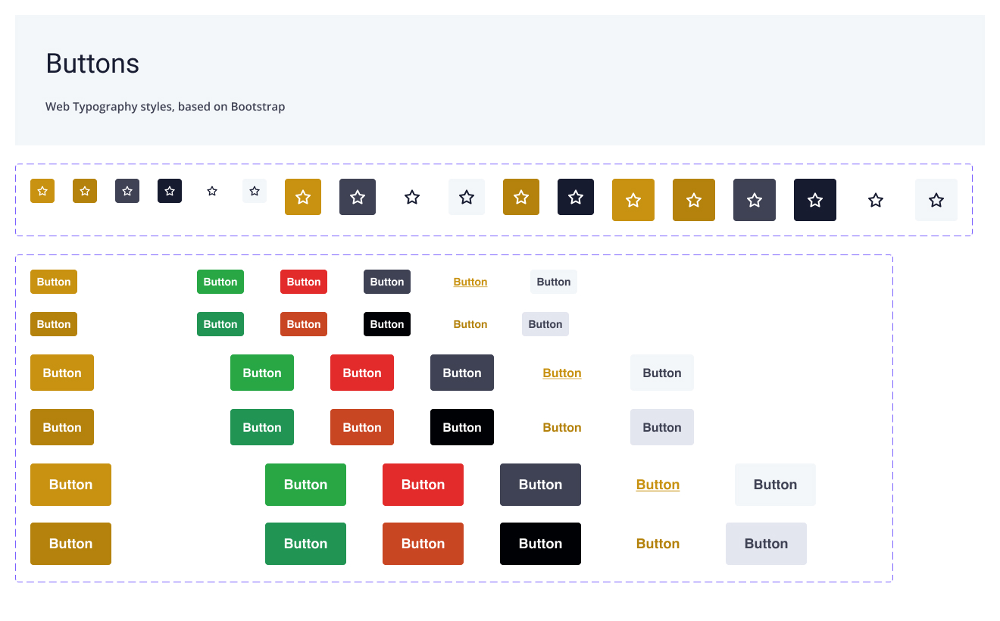

## Practice what you preach

I love working out, years of sitting at a screen have taken their toll on my posture and I learned to counteract this with functional fitness and strength training. Four years ago I joined the [Street Parking](https://streetparking.com "Street Parking website") programme and community. The community has an extremely vibrant community and I shared a redesign of a similar fitness app.

At the start of the UK lockdown, their owners reached out as they needed a UX/UI designer to join their engineering team that was creating an MVP of their platform.

This was a passion project to be involved in, I was given the opportunity to design and resolve a lot of the issues myself and other community members were facing.

## Initial Goals

The technical team was already in place alongside a deadline to start receiving new customers on to the platform. Street Parking already had an existing customer base of **over 35,000 home fitness enthusiasts** but with lockdown forcing gyms to close, their **customer base was growing over 10% per month**.

The member base had existed across a number of platforms and services; [Wodify](https://www.wodify.com/ "Wodify Website"), [Square Space](https://www.squarespace.com "Square Space") and Instagram. The goal of the team was to build a bespoke enterprise platform that could be tailored to suit their programs, promotions and fitness challenges.

## One Designer to Rule Them All

The development team quickly grew from two Angular developers to a team of eleven. With a PO now at the helm, the platform went from being a web product to also delivering a native application on [Nativescript](https://nativescript.org/ "Nativescript website").

As the only designer on the team, my coverage included the UX/UI for :

- A bespoke back-office application
- Responsive web applications for members
- Nativescript application for members that would be delivered on iOS and Android.

## Getting To Market

With over 500 Street Parking workouts under my belt, this meant I had to rely on my own experiences along with the feedback I'd captured in the Facebook group to get an idea to market.

Until launch, user testing had been limited because the new product was under wraps. Beta access was given to long term users who provided initial feedback and testing. Fortunately, the overall experience was an improvement and I was able to deliver a design that was well received.

## Redesigning a Platform

It should be noted that my work wasn't only to create the visuals for all of the platforms but the actual user flows.

Working with the PO and System Architect, who were also long time Street Parking users, we merged and streamlined the previous three platforms into a single flow that could be delivered to both the web and native applications.

The back and forth on this part of the project could fill a case study in itself.

<Gallery sources={["sp-app-dash", "sp-app-section", "sp-app-workout"]} />

## Multi-Platform Figma Libraries

At the time of working on this project, I was also building out the Hydrocarbon design system. I took my experience building Figma libraries to create two child libraries; Native and Web, that took their foundational elements from a parent library.

This was my first multi-platform design system and taught me a lot about setting up and managing Figma. The benefit of this approach is consistent both for the developers and users but also easier to manage as the sole designer.

## Building the Front End

This project was on a deadline to deliver a v1 responsive web app at the time the Wodify subscription was delivered. This meant it was all hands on deck by the development team to get the project live.

I assisted our junior developers in delivering in the frontend work getting deep into creating custom code, fixing issues with bootstrap implementation or mentoring them through layouts with Codeine.

It was refreshing to go back to my roots and work on deliverable front end code.

<Blockquote caption="Street Parking Member">
  This new platform is amazing to just ice the cake. It is so simple. User
  friendly. I LOVE that everything seems to be accessible from one place.
</Blockquote>

## User Feedback

As the launch date came and the team delivered successfully on time it was nail-biting to see what the user feedback would be. There is a vibrant Facebook group that is quick to call out anything.

Thankfully the app was well-received and users were quick to share thanks, feedback and screenshots.

## Next Steps

There is a lot still to deliver, including the native application. But it has been uplifting to deliver a product that not only I use but thousands of other users do too.

With the effects of Covid, health is so important and being able to put such a great product in the hands of users on a daily basis that enhances their well being, is something to be proud of.
