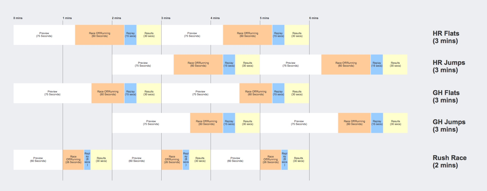

[View William Hill Virtual World (UK Only)](https://sports.williamhill.com/betting/en-gb/virtual-world/horses/flats "William Hill Virtual World")

Virtual Sports is surprisingly one of the largest visited parts of a Sportsbook, filling that void in betting for customers that don't want to burn through their balance on slots or table games.

At William Hill our Virtual World section, containing virtual racing and football products, was receiving a high volume of traffic, but unfortunately had been left to linger without analysis, optimisation or love for a couple of years.

My task as the UX designer and Sportsbook UX lead was to work with the Product Owner, business stakeholders and development team to deliver a new product before the 2018 World Cup.

The key performance indicator (KPI) target for this revamp was to **increase turnover by 25%**. Although the virtual product had been poorly supported, and pretty much left untouched since the first MVP launch, it was still generating a large amount of income. As mentioned previously, sports customers that didn't want to venture into casino products would prefer to play virtual sports between games or in dead spots in the sports calendar.

<ImageText image="vw-graph" altText="Virtual world drop graph">

## Starting With Data

A quick analysis of betting behaviour showed that there was a _steep decline_ in users placing more than a single bet. Unfortunately, our tracking didn't allow us to dig deeper to identify if this was due to the platform performance or customer behaviour.

To reach the business goal it was clear that we had to decrease the friction for users to place multiple selections per page visit.

- List Item
- List Item

</ImageText>

<Blockquote>
  The target number for this revamp was to increase turnover by 25%
</Blockquote>

<ImageText image="vw-wireframe" altText="Virtual World early wireframe">

## Timing Is Everything

Using the analysis the product owners decided to make a few key changes:

- Remove the homepage (see wireframe) and take the user to the main action.
- Introduce three new products.
- Decrease the time between events.
- Creating more events per day.
- Combine the less popular sports into a single stream.

</ImageText>

## Review the KPIs

Reviewing the KPIs we had to achieve and the changes to the product I started by analysing the overlapping in product channels, like an electronic programme guide (EPG). By taking this initial approach we could start to think about customer behaviours and how they might move between sports to quickly place multiple bets, meeting our KPI goal.

Looking at the diagram above you can see how a customer visiting the virtual product during halftime in a live football game could quickly place a bet on five virtual games and three match day games in the time-space.

<ImageText image="vw-userfeedback" altText="Spotlight of User Feedback">

## User Testing Feedback

We carried out three rounds of user testing using the What Users Do tool. After user testing various concepts, we found we had enough feedback to move forward with a final design.

We integrated a countdown on the **stream tabs (1)** and status to make the user aware of how long they had to a race start while focusing on the betting opportunities within a live stream. We used tabs to collate the different streams e.g. "Jumps/Flats" within their parent sports e.g. **Horse Racing (2)**. The developers were also able to manipulate the interface to only load the content the users were focused on to improve performance.

</ImageText>

## Continual Events

Within each stream, by default, the user is presented with the next race. As each race results, the cards automatically tick through to the next race and change to a resulted listing when the data is complete. Like the autoplay of Netflix and YouTube, the user is continually presented with the next available opportunity to match the streaming content above.

The video below demonstrates the initial prototype of the interaction:

<YouTube youTubeId="xZEYNTSV6_s" />

<ImageText image="vw-adaptive-layout" altText="Adaptive Layout Mockups">

## Adaptive Not Responsive

One technical advantage that we had with this project was to move to an adaptive layout with components being built from a new React component library. This was a milestone change as our site was mainly responsive, which came with a lot of design restrictions for a data heavy site.

On this new platform we were able to focus on the optimal journey for each device.

</ImageText>

## Working Agile

From the get-go, the design team took a DevOps approach to this project. Attending daily stand-ups and having set thirty-minute demos twice a week we were able to work out the scope of work.

Working closely with the dev team they were able to contribute solutions and technical approaches, particularly harnessing the power of the new React codebase.

Working in this manner allowed myself and the UI designer to reduce the amount of waste in over-annotating or delivering design assets, and in turn, we managed to get the Minimal Viable Product (MVP) to market on time.

## MVP Learnings So Far

The product was launched as an MVP before the 2018 World Cup with many new sports streams still to be added. The current MVP is performing better than the product it replaced and at the time of writing the numbers were on target to hit the £2 million increase in turnover.

A key issue still to be added to the mobile product is the ability to swipe the carousel. We used further user testing of the live product to feedback to the product and development teams that this was a priority issue; one to be resolved in the next phase.

Although the product has increased the turnover it is being monitored through analytics and Usabilla tools to gather further feedback that the Product Owner planned to take into the next sprint.
